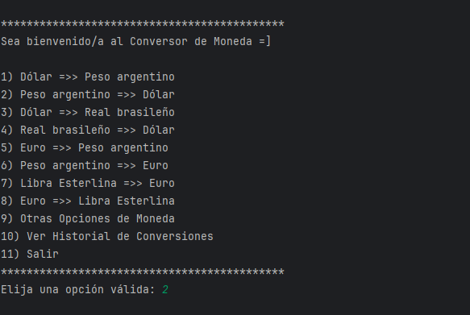
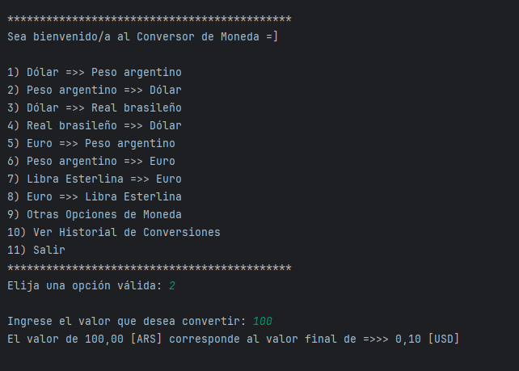
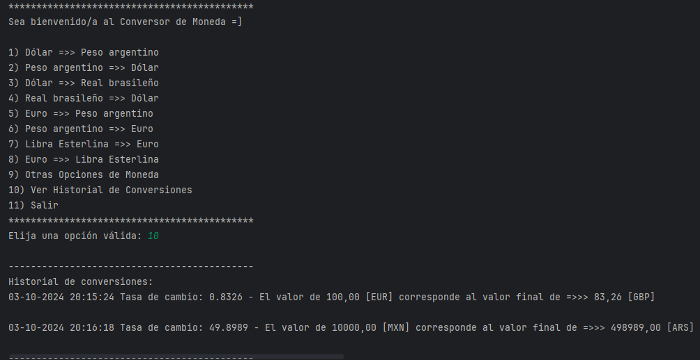
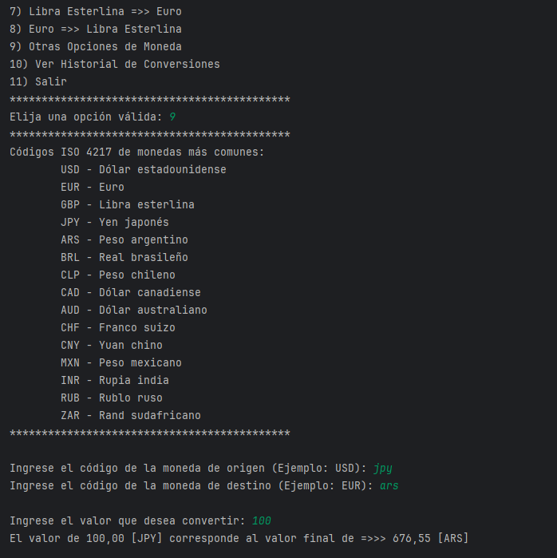
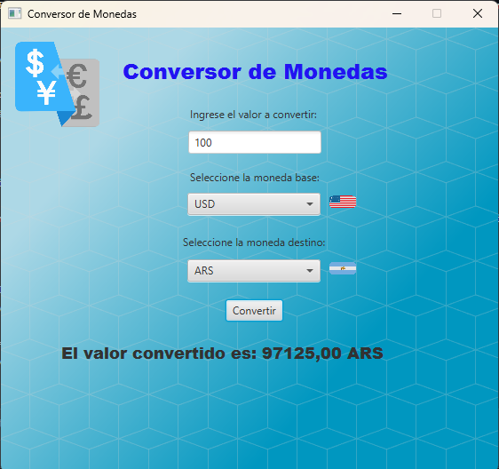

# 🌍💱 Conversor de Monedas 💱🌍

¡Bienvenido al Conversor de Monedas! Este proyecto es una aplicación en Java que te permite convertir entre varias monedas de forma sencilla y eficiente, utilizando la API de ExchangeRate-API para obtener las tasas de cambio más recientes.

<p align="center">

</p>

## 💡 Desafío Alura-ONE Java Challenge Conversor de Monedas 💡
Conversor de Monedas, solicitud a una API de tasas de cambio, manipular datos JSON, filtrar y mostrar las monedas de interés



## 🚀 Funcionalidades
- Conversión entre múltiples monedas en tiempo real.
- Historial de conversiones realizadas.
- Registros con marca de tiempo para cada conversión.
- Soporte para una amplia gama de monedas.
- Interfaz de usuario de línea de comandos.

### 1. 🖥️ Interfaz de Consola
El programa cuenta con una interfaz de consola fácil de usar, donde podrás seleccionar las monedas que deseas convertir y visualizar los resultados de forma clara.



### 2. 🌎 Soporte para Múltiples Monedas
Puedes convertir entre las siguientes monedas principales:
- 🇺🇸 **USD** - Dólar estadounidense
- 🇪🇺 **EUR** - Euro
- 🇬🇧 **GBP** - Libra esterlina
- 🇯🇵 **JPY** - Yen japonés
- 🇦🇷 **ARS** - Peso argentino
- 🇧🇷 **BRL** - Real brasileño
- 🇨🇱 **CLP** - Peso chileno
- 🇨🇦 **CAD** - Dólar canadiense
- 🇦🇺 **AUD** - Dólar australiano
- 🇨🇭 **CHF** - Franco suizo
- 🇨🇳 **CNY** - Yuan chino
- 🇲🇽 **MXN** - Peso mexicano
- 🇮🇳 **INR** - Rupia india
- 🇷🇺 **RUB** - Rublo ruso
- 🇿🇦 **ZAR** - Rand sudafricano

Además, puedes acceder a **opciones personalizadas** donde eliges las monedas origen y destino, ingresando directamente sus códigos ISO 4217.

### 3. 📜 Historial de Conversiones
El programa guarda un historial de las conversiones realizadas, mostrándote:
- La fecha y hora de la conversión.
- El valor a convertir.
- Las monedas que convertiste.
- La tasa de cambio utilizada.
- El valor convertido.

Esto te permite llevar un registro de tus actividades de conversión.



### 4. 🕒 Registros con Marca de Tiempo
Cada conversión realizada es registrada con la **fecha y hora exacta** utilizando la biblioteca `java.time`. Esto te permite ver cuándo realizaste cada conversión, proporcionando más transparencia y control.

### 5. 🛠️ Validación de Entrada
El sistema asegura que:
- Los valores ingresados sean **números válidos y positivos**.
- Los códigos de moneda sean válidos, mostrando una lista de monedas ISO 4217 para referencia.

### 6. 🌐 Consulta a API Externa
El programa obtiene las tasas de cambio actualizadas utilizando la [ExchangeRate-API](https://www.exchangerate-api.com/). Esto garantiza que las conversiones siempre se realicen con datos precisos y confiables.

## 📦 Instalación

### API
Este proyecto usa la API de ExchangeRate-API.
> [!CAUTION]
> Se requiere una clave API válida para su funcionamiento.

### Prerrequisitos:
- Java 17 o superior
- Conexión a Internet para las consultas a la API
- IDE o editor de texto como IntelliJ IDEA, Eclipse o VSCode
- Tu propia clave o API_KEY

### Pasos:
1. **Clonar el repositorio:**
   ```bash
   git clone https://github.com/tu_usuario/challenge-conversor-monedas.git
   ```
2. Importar el proyecto en tu IDE favorito.

3. Agregar la clave API: Dentro de la clase Principal, reemplaza el valor de apiKey con tu clave personal obtenida de ExchangeRate-API.
   Es fácil obtenerla, solo necesitas tener una direccion de correo donde te la envían
   ```java
   String apiKey = "TU_CLAVE_API_AQUI";
   ```

5. Ejecutar la aplicación: Ejecuta la clase Principal desde tu IDE para iniciar el programa.

## 🎯 Uso
1. Al ejecutar el programa, se te presentará un menú con las diferentes opciones.

2. Selecciona la opción deseada y sigue las instrucciones.

3. Para las opciones personalizadas (opción 9), ingresa los códigos ISO 4217 de las monedas que deseas convertir.

4. Puedes consultar el Historial de Conversiones realizadas (opción 10).

5. Para salir del programa usa la opción 11.

## 🛡️ Validaciones
Valores positivos: El sistema no permite ingresar valores negativos o no numéricos.
Códigos ISO válidos: Solo se permiten códigos de moneda reconocidos.

## 📚 Ejemplo de Uso

Códigos ISO 4217 de monedas más comunes:
- USD - Dólar estadounidense
- EUR - Euro
- GBP - Libra esterlina
- JPY - Yen japonés
- etc...



## 🛠️ Tecnologías Utilizadas
- Java 17.0.12: Lenguaje principal. MVC: Modelo-Vista-Controlador
- JavaFX (Opcional): Para futuras versiones con interfaz gráfica.
- HttpClient: Para realizar solicitudes HTTP a la API de tasas de cambio.
- HttpRequest, HttpResponse.
- Gson: Para el procesamiento de la respuesta JSON de la API.
- java.time: Para manejar las marcas de tiempo.

# 💻💱 BONUS 💱💻
## 🎁 Aplicacion de Conversor de Monedas con interfaz gráfica en JavaFX
Para quienes leyeron hasta el final de este README les dejo el archivo: **challenge-conversor-monedas-javafx.jar**, listo para que lo bajen en su disco y ejecuten la aplicación de escritorio.



Les dejo además el link al repositorio en GitHub donde encontraran ese proyecto desarrollado en Java con interfaz en JavaFX:
[challenge-conversor-monedas-javafx](https://github.com/Alb3rtoGitHub/challenge-conversor-monedas-javafx.git)

## 📜 Licencia y Contribuciones
Siéntete libre de utilizarlo, modificarlo y distribuirlo como desees.

¡Gracias por usar el Conversor de Monedas, las contribuciones son bienvenidas! Si tienes alguna pregunta o sugerencia, no dudes en abrir un issue o enviarme un mensaje.

Usa el código con precaución. 🚀
## 👨‍💻Autor: Alberto Vallecillo
<a href="https://linkedin.com/in/alberto-vallecillo" target="_blank">

</a>
<a href="https://github.com/Alb3rtoGitHub" target="_blank">

</a>
